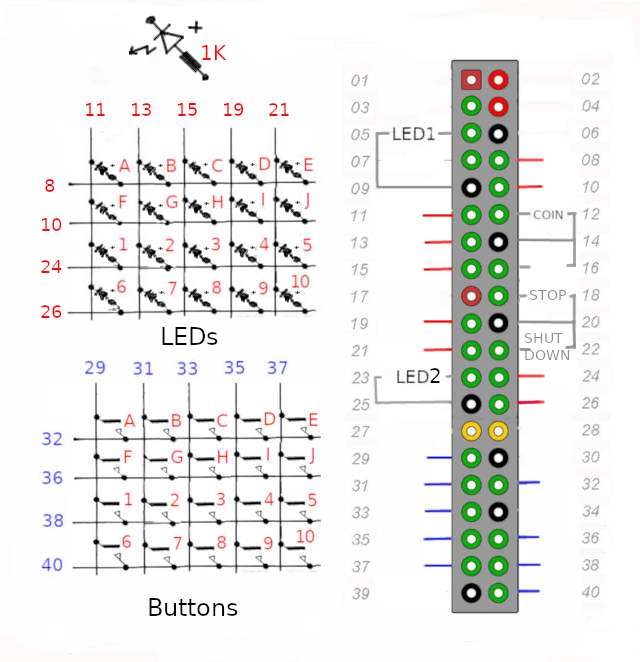
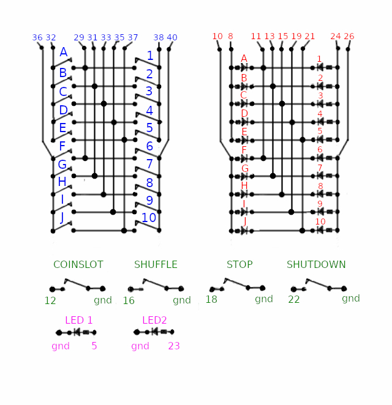
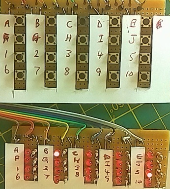

# Pi_BLMP3_Player

This version uses 20 buttonss to select upto 100 tracks, using A-J and 1-10, eg A5. It will also display with 20 leds which track is playing.

It will also play continous by holding down B for 5 seconds. A will choose previous track , C next track, D skip 10 tracks forward and E skip 10 tracks back.
It will display the track being played using the leds. It will play more than 100 tracks in this mode but won't display above 100.
## Schematic

## Showing Playing Track B5

